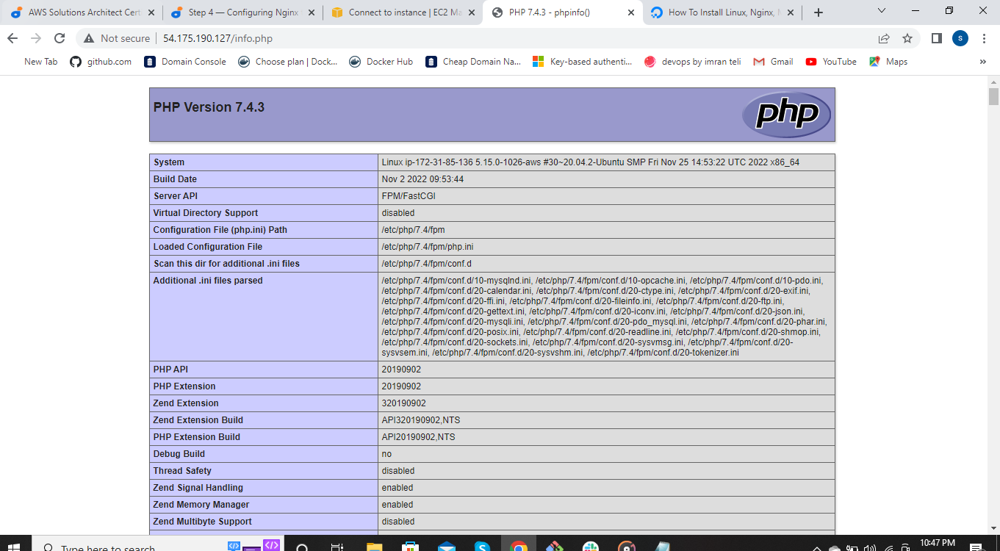
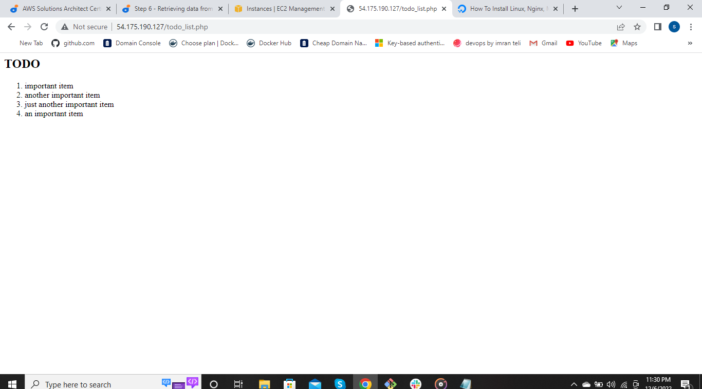

## WEB STACK IMPLEMENTATION (Lemp Stack)

Let's dive into the architecture of the Lemp stack, understanding how Linux provides a solid foundation, Nginx serves as a powerful web server, MySQL handles the database, and PHP empowers server-side functionality.

Throughout the course/project,we will set up a Linux environment, configure Nginx for optimal performance, manage MySQL database, and develop PHP code to bring application to life. Through the practical and hands-on exercises, you will gain proficiency in building dynamic websites with the LEMP stack. We will explore techniques for handling user requests, interacting with database, processing forms, and implementing robust security measures.

In this project you will implement a similar stack, but with an alternative Web Server - **NGINX**, which is also very popular and widely used by many websites in the internet.

### SIde Self study

1. Make yourself familiar with basic **SQL syntax and most commonly used commands**

2. Be comfortable using not lony VIM, but also **Nano editor** as well, get to know **basic Nano commands**.

### Step 0 - Preparing prerequisites

In order to complete this project you will need an AWS account and a virtual server with Ubuntu OS.

**Hint:** There is simpler way that do not require conversion of **.pem** key to **.ppk** - using **Git Bash**.

Download and install Git Bash, then launch Git Bash and run the following command:

• ssh -i <Your-private-key.pem> ubuntu@<EC2-Public-IP-address>

## Step 1 - Installing the Nginx Web Server

In order to display web pages to our site visitors, we are going to employ Nginx, a high-performance web server. We'll use the **apt** package manager to install this package.

For this session, start off by updating your server's package index. Following that, you can use **apt install** to get Nginx installed:

• $ sudo apt update

• $ sudo apt install nginx

When prompted, enter **Y** to confirm that you want to install Nginx.

To verify that nginx was sucessfully installed and is running as a service in Ubuntu, run:

• $ sudo systemctl status nginx

Before we can receive any traffic by our Web Server, we need to open **TCP port 80** which is default port that web brousers use to access web pagesin the internet.

As we know, we have TCP port 22 open by default on our EC2 machine to access it via SSH, so we need to add a rule to EC2 configuration to open inbound connection through port 80:

Our server is running and we can access it locally from the internet. First, let us try to check how we can access it locally in our Ubuntu shell, run:

• $ curl http://localhost:80

or

• $ curl http://127.0.0.1:00

These 2 commands above actually do pretty much the same- they use **'curl'** command to request our Nginx on port 80 (actually you can even try to not specify any port - it will work anyway).

Lets test how our Nginx server can respond to request from the internet.

• http://<Public-IP-Address>:80

Another way to retrieve your Public IP address, other than to check it in AWS Web console, is to use following command:

• curl -s http://169.254.169.254/latest/meta-data/public-ipv4

The URL in browser shall also work if you do not specify port number since all web browsers use port 80 by default.

If you see this following page, then your web server is now correctly installed and accessible through your firewall.

## Step 2 - Installing MySQL

Having a web server up and running, you need to install a **Database Management System (DBMS)** to be able to store and manage data for your site in a **relational database. MySQL** is a popular relational database management system used within PHP environments.

Use **'apt** to acquire and install this software:

• $ sudo apt install mysql-server

When prompted, confirm installation by typing **Y**, and then **ENTER**.

When the installation is fininshed, log in to the MySQL console by typing:

• $ sudo mysql

This will connect to the MySQL server as the administrative user **root**, which is inferred by the use of sudo whwn running this command. You should see an output like this:

It's recommended that you run a security script that comes pre-installed with MySQL. This script will remove some insecure default settings and the lock down access to your database system. Before running the script you will set a password for the **root** user, using mysql_native_password as default authentication method. We're defining this user's password as **PassWord.1**,

ALTER USER 'root'@'localhost' IDENTIFIED WITH mysql_native_password BY 'PassWord.1';

Exit the MySQL shell with:

• mysql> exit

Start the interactive script by running:

• $ sudo mysql_secure_installation

This will ask if you want to configure the **VALIDATE PASSWORD PLUGIN**.

**Note**: Enabling this feature is something of a judgment call. If enabled, passwords which don't match the specified criteria will be rejected by MySQL with an error. It is safe to leave validation disabled, but you should always use strong, unique passwords for database credentials.

Answer **Y** for yes, or anything else to continue without enabling. If you answer "yes", you'll be asked to select a level of password validation.

Lets test if we're able to log in tothe MySQL console by typing:

• $ sudo mysql -p

Notice the **-p** flag in this command, which will prompt you for the password used after changing the **root** user password.

To exit the MySQL console, type:

• mysql> exit

Your MySQL server is now installed and secured. Next, we will install PHP, the final component in the LEMP stack.

## Step 3 - Installing PHP

You have Nginx installed to serve your content and MySQL installed to store and manage your data. Now let's install **PHP** to process code and generate dynamic content for the web server. Nginx requires an external program to handle PHP processing and act as a bridge between the PHP interpreter itself and the web server. You'll need to install **php-fpm**, which stands for "PHP fastCGI process manager", and tell Nginx to pass PHP request to this software for processing. Additionally, you"ll need **php-mysql**, a PHP module that allows PHP to communicate with MySQL-based databases. Core PHP packages will automatically be installed as dependencies.

To install these 2 packages at once, run:

• $ sudo apt install php-fpm php-mysql

When prompted, type **Y** and press **ENTER** to confirm installation.

You now have PHP components installed. Next, you will configure Nginx to use them.

## Step 4 - Configuring Nginx to Use PHP Processor

When using the Nginx web server, we can create server blocks (similar to virtual host in Apache) to encapsulate configuration details and host more than one domain on a single server. In this guide, we will use **projectLEMP** as an example domain name.

Create the root web directory for **your_domain** as follows:

• $ sudo mkdir /var/www/projectLEMP

Next, assign ownership of the directory witgh the $USER environment variable, which will reference your current system user: 

• $ sudo chown -R $USER:$USER /var/www/projectLEMP

Then, open a new configuration file in Nginx's **sites-available** directory using your prefrered command-line editor. Here, we'll use **nano**:

$ sudo nano /etc/nginx/sites-available/projectLEMP

This will create a new blank file. Paste in the following bare-bones configuration:

• #/etc/nginx/sites-available/projectLEMP

server {
    listen 80;
    server_name projectLEMP www.projectLEMP;
    root /var/www/projectLEMP;

    index index.html index.htm index.php;

    location / {
        try_files $uri $uri/ =404;
    }

    location ~ \.php$ {
        include snippets/fastcgi-php.conf;
        fastcgi_pass unix:/var/run/php/php8.1-fpm.sock;
     }

    location ~ /\.ht {
        deny all;
    }

}

When you're done editing, save and close the file. If you're using **nano**, you can do so by typing **CTRL+X** and then **Y** and **ENTER** to confirm.

Activate your configuration by linking to the config file from Nginx's **sites-enabled** directory:

• $ sudo ln -s /etc/nginx/sites-available/projectLEMP /etc/nginx/sites-enabled/

This will tell Nginx to use the configuration next time it is reloaded. You can test your configuration for syntax errors by typing:

• $ sudo nginx -t

If any errors are reported, go back to your configuration file to review its contents before continuing.

We also need to disable default Nginx host that is currently configured to listen on port 80, for this run:

• sudo unlink /etc/nginx/sites-enabled/default

Reload Nginx to apply the changes:

• $ sudo systemctl reload nginx

Your new website is now active, but the web root/var/www/projectLEMP is still empty. Create an index.html file in the location so that we can test that your new server block works as expected:

• sudo echo 'Hello LEMP from hostname' $(curl -s http://169.254.169.254/latest/meta-data/public-hostname) 'with public IP' $(curl -s http://169.254.169.254/latest/meta-data/public-ipv4) > /var/www/projectLEMP/index.html

Now go to your browser and try to open your website URL using IP address:

• http://<Public-IP-Address>:80

Your LEMP stack is now fully configured. In the next step, we'll create a PHP script to test that Nginx is in fact ableto handle **.php** files within your newly configured website.

## Step 5 - Testing PHP with Nginx

At this point, your LAMP stack is completely installed and fully operational.

You can test it to validate that Nginx can correctly hand **.php** file off to your PHP processor.

You can do this by creating a test PHP file in your document root. Open a new file called **info.php** within your document root in your text editor:

• $ nano /var/www/projectLEMP/info.php

Type or paste the following lines into the new file. This is valid PHP code that will return information about your server:

• <?php
phpinfo();

You can now access this page in your web browser by visiting the domain name or public IP address you've set up in your Nginx configuration file, followed by **/info.php**:

• http://`server_domain_or_IP`/info.php

We should see a page containing information about PHP

After checking the relevant information about your PHP server through that page, it's best to remove the file you created as it contains sensitive information about your PHP environment and your Ubuntu server. You can use **rm** to remove that file:

• $ sudo rm /var/www/your_domain/info.php

You can always regenerate this file if you need it later.

## Step 6 - Retrieving data from MySQL database with PHP

We will create a database named **example_database** and a user named **example_user**, but you can replace these names with different values.

First, connect to the MySQL console using the **root** account:

• $ sudo mysql

To create a new database, run the following command from your MySQL console:

• mysql> CREATE DATABASE `example_database`;

The following command create a new user named **example_user**, using mysql_native_password as default authentication method.

We're defining this user's password as **PassWord.1**, but you should replace this value with a secure password of your own choosing

• mysql>  CREATE USER 'example_user'@'%' IDENTIFIED WITH mysql_native_password BY 'PassWord.1';

Now we need to give this user permission over the **example_database** database:

• mysql> GRANT ALL ON example_database.* TO 'example_user'@'%';

This will give the **example_user** user full privileges over the **example_database** database, while preventing this user from creating or modifying other databases on your server.

• mysql> exit

You can test if the new user has the proper permissions by logging in to MySQL console again, this time using the custom user credentials:

• $ mysql -u example_user -p

Notice the **-p** flag in this command, which will prompt you for the password used when creating the **example_user** user. After logging in to the MySQL console, confirm that you have access to the **example_database** database:

• mysql> SHOW DATABASES;

This will give you the following output:

Next, we'll create a test table named **todo_list**. From the MySQL console, run the following statement:

• CREATE TABLE example_database.todo_list (item_id INT AUTO_INCREMENT,content VARCHAR(255),PRIMARY KEY(item_id));

Insert a few rows of content in the test table. You might want to repeat the next command a few times, using different VALUES:

• mysql> INSERT INTO example_database.todo_list (content) VALUES ("My first important item");

To confirm that the data was successfully saved to your table, run:

• mysql>  SELECT * FROM example_database.todo_list;

You'll see the dollowing output:

After confirming that you have valid data in your test table, you can exit that MySQL console:

• mysql> exit

Now you can create a PHP script that will connect to MySQL and query for your content. Create a new PHP file in your custom web root directory using your preferred editor: We'll use vi for that:

• $ nano /var/www/projectLEMP/todo_list.php

The following PHP script connects to the MySQL database and queries for the content of the **todo_list** table, displays the results in a list. If there is a problem with the database connection, it will throw an exception.

• <?php
$user = "example_user";
$password = "PassWord.1";
$database = "example_database";
$table = "todo_list";

try {
  $db = new PDO("mysql:host=localhost;dbname=$database", $user, $password);
  echo "<h2>TODO</h2><ol>";
  foreach($db->query("SELECT content FROM $table") as $row) {
    echo "<li>" . $row['content'] . "</li>";
  }
  echo "</ol>";
} catch (PDOException $e) {
    print "Error!: " . $e->getMessage() . " ";
    die();
}

We can now access the page using:

• http://<Public-IP-Address>/info.php

**That means your PHP environment is ready to connect and interact with your MySQL server.**